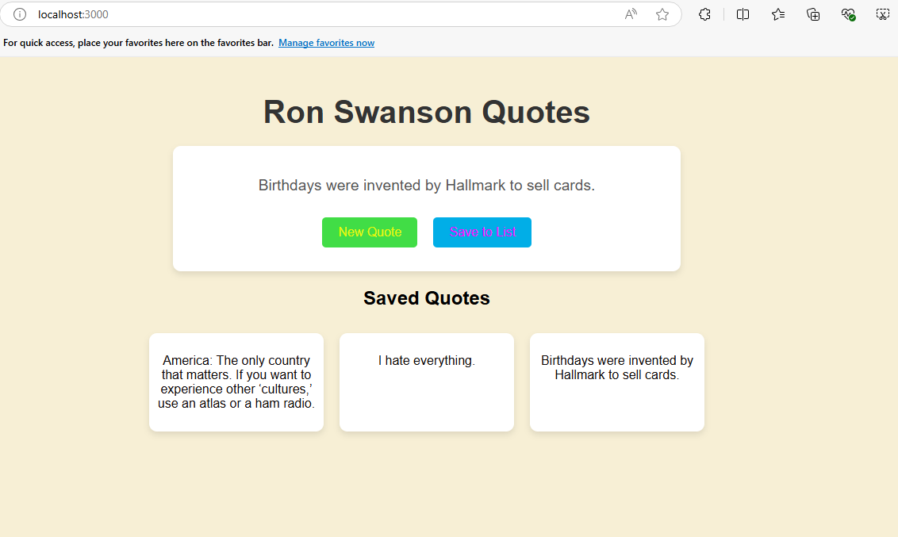

# Ron Swanson Quotes App

This is a simple React app that fetches random quotes from the [Ron Swanson Quotes API](https://ron-swanson-quotes.herokuapp.com/v2/quotes), displays them in styled cards, and allows users to save quotes to a list.

## Features
- Fetch random Ron Swanson quotes
- Display quotes in styled cards
- Save quotes to a personal list

## Demo
<!-- You can add a screenshot of your app -->

## Getting Started

### Prerequisites
Ensure you have Node.js and npm installed on your machine. You can download them from [here](https://nodejs.org/).

### Installation
1. **Clone the repository**:
    ```bash
    git clone https://github.com/your-username/ron-swanson-quotes.git
    ```

2. **Navigate into the project directory**:
    ```bash
    cd ron-swanson-quotes
    ```

3. **Install the dependencies**:
    ```bash
    npm install
    ```

### Running the App
Once the dependencies are installed, you can run the app locally:

```bash
npm start
